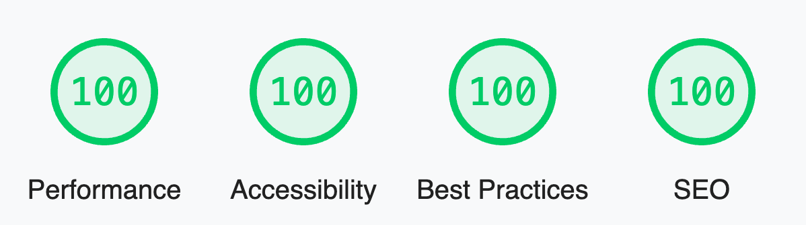

<p align="center">
  
</p>

<br/>
<div align="center">
  <a href="https://twitter.com/littlesticksdev">
  
</a>
  <a href="https://littlesticks.dev/templates/odyssey-theme?get-template=true">
    
  </a>
  <a href="https://littlesticks.dev/discord">
    
  </a>
  
</div>
<br/>

# Odyssey Theme

Odyssey Theme is a modern theme/starter for a business or startup's marketing website. It provides landing page examples, a full-featured blog, contact forms, and more. It is fully themeable to match your business' branding and style. It even includes a theme switcher component to show how easily the entire style of the site can be changed with only a few lines of CSS.

## Features

<p align="center">
  
</p>


- ✅ **A perfect score in Lighthouse**
- ✅ **Blazing fast performance thanks to Astro 🚀**
- ✅ **A Full Featured Blog with Tagging**
- ✅ **Fully theme-able styles with for buttons, shapes, backgrounds, surfaces, etc.**
- ✅ **Responsive, mobile-friendly landing pages**
- ✅ **SEO Best Practices (Open Graph, Canonical URLs, sitemap)**
- ✅ **Performant Local Fonts Setup**
- ✅ **Contact Forms Setup for Netlify, Formspree, Formspark, etc.**
- ✅ **A package of ready-to-use UI components**


## Demo

View a [live demo](https://odyssey-theme.littlesticks.site/) of the Odyssey Theme.

## Documentation

1. View the [Theme Setup Guide](https://odyssey-theme.littlesticks.site/theme/theme-setup)
2. View the [Customizing the Theme Guide](https://odyssey-theme.littlesticks.site/theme/customizing-odyssey)

## Usage

### Remote IDEs 

<p>
  <a href="https://stackblitz.com/github/littlesticksdev/odyssey-theme/tree/main/theme">
  
  </a>
</p>
<p>
  <a href="https://codesandbox.io/s/github/littlesticksdev/odyssey-theme/tree/main/theme">
  
  </a>
</p>
<p>
  <a href="https://gitpod.io/#https://github.com/littlesticksdev/odyssey-theme/tree/main/theme">
  
  </a>
</p>

**Or**

### Local Development

```bash
cd photography

npm install

npm start
```

## Deploy

push to github

